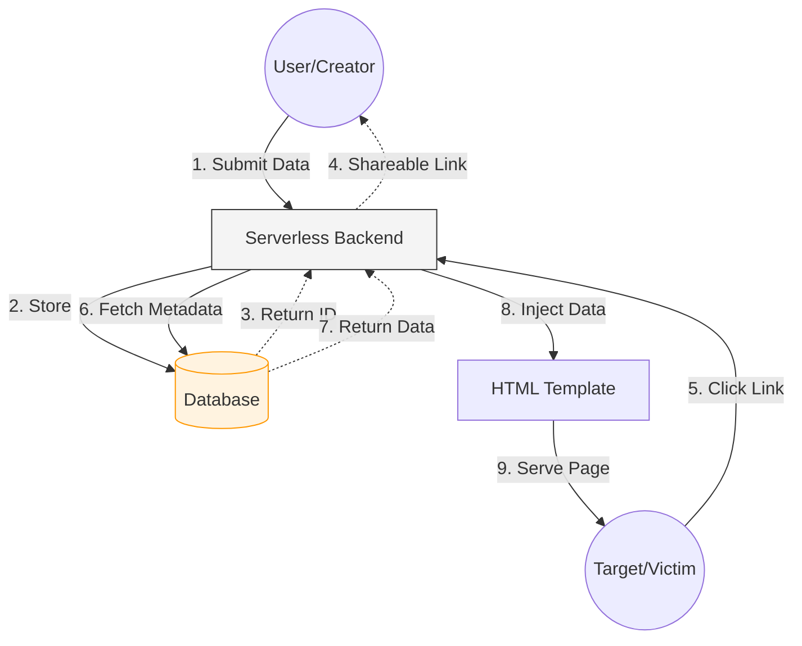
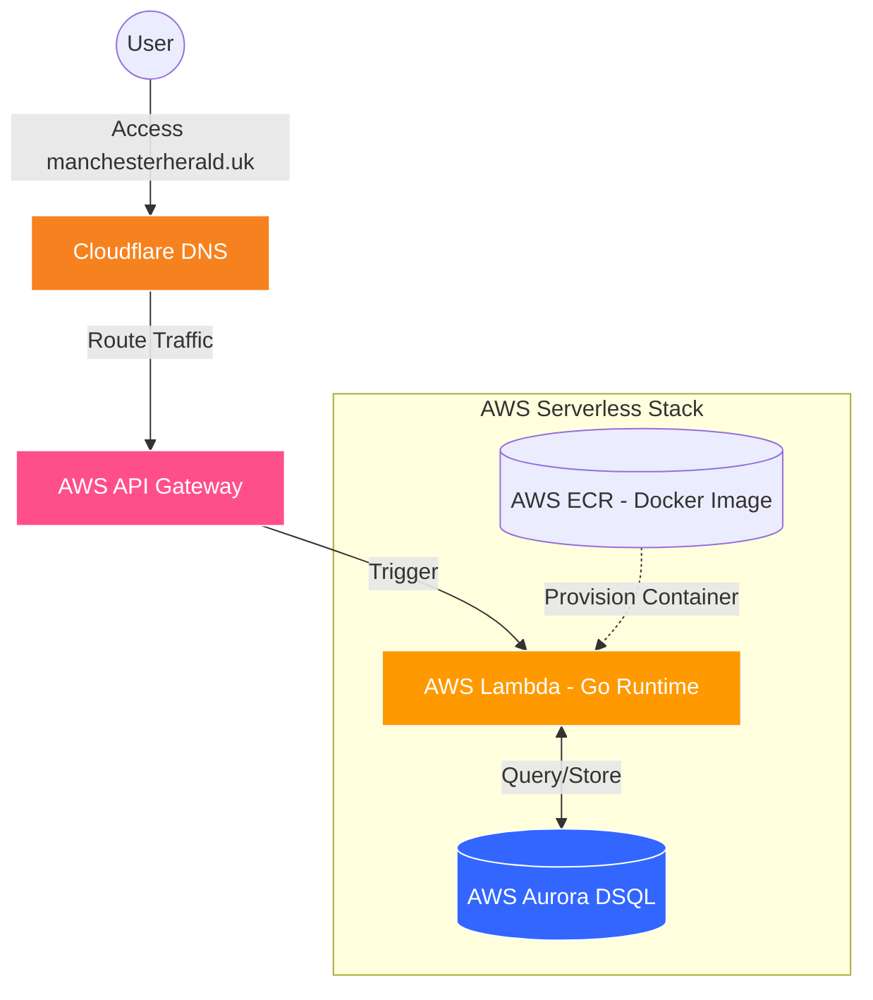

# Manchester Herald 🗞️

**Manchester Herald** is a lightweight, serverless web application designed for creating convincing "bait-and-switch" pranks. By leveraging Open Graph (OG) metadata and a credible-looking news domain, users can generate links that look like legitimate breaking news in messaging apps, only to reveal a custom prank image when clicked.

**[Live Preview](https://manchesterherald.uk/)**

## Features

- **Custom Link Previews:** Set a custom title and thumbnail image that appear when the link is shared on platforms like Discord, WhatsApp, or iMessage.
    
- **The "Reveal":** Host a completely different image on the actual landing page to surprise your friends
    
- **Credible Branding:** The `manchesterherald.uk` domain is designed to mimic a local UK news outlet to maximize the success of the prank.
    
- **Serverless Architecture:** Optimized for high performance and low cost using serverless functions.
    

---

#  How It Works

1. **Creation:** The user visits the homepage and enters a headline, a preview image URL (for the thumbnail), and a destination image URL (the prank).
    
2. **Storage:** The `/submit` endpoint saves these details to a database and generates a unique article ID.
    
3. **The Bait:** The user shares the unique URL: `manchesterherald.uk/news/articles/{id}`.
    
4. **The Switch:** * When the messaging platform crawls the link, the server injects the **thumbnail** and **title** into the HTML `<head>` tags.
    
    - When the human clicks the link, the browser renders the **actual prank image** within the news-themed template.

## Screenshots
<table style="border: none; border-collapse: collapse;">
  <tr style="border: none;">
    <td style="border: none; vertical-align: middle;">
      
    </td>
    <td style="border: none; vertical-align: middle;">
      
    </td>
    <td style="border: none; vertical-align: middle;">
      
    </td>
  </tr>
</table>

---
# System Design

The application utilizes a Serverless architecture to handle dynamic Meta Tag injection (SSR) and data persistence.

### Logic Flow

1. **Home Endpoint:** Serves the static UI for the prank creator.
    
2. **Submit Endpoint (`POST`):** Validates input, writes to the database, and returns a unique hash.
    
3. **View Endpoint (`GET`):** * Triggered by the unique ID.
    
    - Queries the database for specific article data.
        
    - Server-side injects data into a template to ensure Open Graph crawlers see the "fake" news data.

### Notes

- The project intentionally separates **preview metadata** from **displayed content**
    
- The architecture is simple by design
    
- Most complexity comes from:
    
    - Serverless deployment constraints
        
    - Correct Open Graph handling for social previews
---
# Deployment Architecture

The application is built for high availability and zero-maintenance scaling using a containerized Go runtime on AWS.

1. **Containerization:** The Go application is wrapped for AWS Lambda, built as a Docker image, and pushed to **AWS ECR**.
    
2. **Compute:** An **AWS Lambda** function is instantiated from the ECR image, providing a cost-effective, serverless execution environment.
    
3. **Networking:** **AWS API Gateway** acts as the entry point, routing external traffic to the Lambda function.
    
4. **DNS & Edge:** The domain is managed via **Cloudflare**, with CNAME records pointing to the API Gateway for optimized edge delivery and DDoS protection.
    
5. **Persistence:** Data is stored in **AWS Aurora DSQL**, a serverless PostgreSQL-compatible database, ensuring the entire stack remains "scale-to-zero."

## Infrastructure Map

# Architectural Decisions

- **Go + AWS Lambda**  
    The backend is implemented in Go and deployed on AWS Lambda to achieve low cold-start latency and efficient request handling under high concurrency.
    
- **Server-Side Rendering (HTML)**  
    Pages are rendered server-side and delivered as HTML, resulting in near-instant initial load times and minimal client-side computation.
    
- **Amazon API Gateway**  
    API Gateway provides automatic scaling, built-in rate limiting, and request validation, reducing operational overhead while improving reliability.
    
- **Cloudflare Integration**  
    Cloudflare sits in front of AWS infrastructure to provide DDoS protection, traffic filtering, and edge-level caching, while abstracting direct access to underlying AWS resources.
    
- **Aurora DSQL + Lambda Auto-Scaling**  
    The data layer uses Aurora DSQL in combination with Lambda, enabling automatic scaling and resilient handling of traffic spikes without manual capacity planning.

This architecture prioritizes low latency, horizontal scalability, and minimal operational complexity while maintaining strong security boundaries. 

# Engineering Retrospective / Tradeoffs

- **SSR over Client-Side Rendering**  
    Client-side rendering was intentionally avoided, as OG crawlers do not execute JavaScript. Server-side HTML was the only reliable solution, even though it reduced frontend flexibility.
    
- **Aurora DSQL over Traditional RDS**  
    Aurora DSQL was chosen to preserve a fully serverless stack, accepting some limitations in exchange for automatic scaling and reduced operational overhead.
    
- **Minimal Feature Surface**  
    Advanced features (authentication, editing, deletion) were intentionally excluded to keep the system simple, stateless, and resilient under unpredictable traffic patterns.
### Future Improvements

- Add metadata versioning to handle crawler cache invalidation more predictably
    
- Introduce structured logging and tracing for improved observability
    
- Add abuse prevention mechanisms (per-IP submission limits, TTL-based cleanup)
